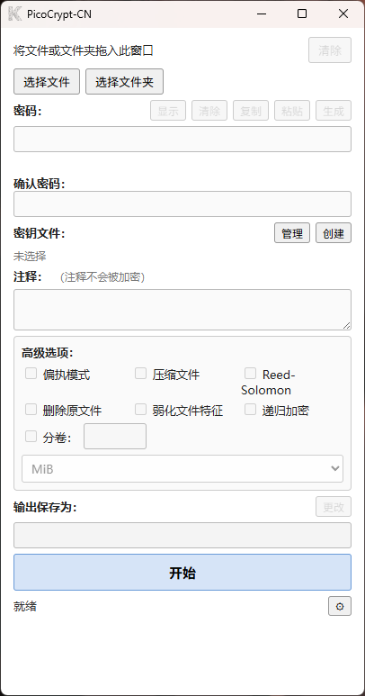

# PicoCrypt-CN

基于 [Picocrypt](https://github.com/Picocrypt/Picocrypt) 使用 Wails 3 重制的桌面版加密工具。

加密核心从原版 Picocrypt v1.49 逐行移植，生成的加密文件与原版 **100% 兼容**。

## 主要特性

- 完整兼容原版加解密功能
- 中文 / 英文界面切换
- 支持拖放文件 / 文件夹
- 偏执模式、Reed-Solomon、弱化文件特征、递归加密等高级选项
- 设置功能：记住上次选项、默认输出目录
- 轻量界面，操作简单
- 
## 界面预览



## 与原版的主要区别

- 使用 Wails 3 重新实现界面
- 默认支持中文界面，并可切换英文
- 增加了设置功能（记住选项状态、默认输出目录）
- 体积比原版更大（约 10MB，原版约 3MB）
- 处理速度较原版略慢（约 3MB/s）

## 致谢

本项目加密核心基于 [Picocrypt](https://github.com/Picocrypt/Picocrypt) 原版代码移植，感谢原作者的工作与开源贡献。

## 下载

请到 [Releases](https://github.com/bliey/PicoCrypt-CN/releases) 页面下载最新版本的 `PicoCrypt-CN.exe`。

## 使用方法

1. 下载并运行 `PicoCrypt-CN.exe`
2. 将文件或文件夹拖入窗口
3. 输入密码（可选密钥文件）
4. 点击开始进行加密或解密

## 开发

```sh
# 安装前端依赖
cd frontend && npm install && cd ..

# 开发模式
wails3 dev

# 构建
wails3 build
